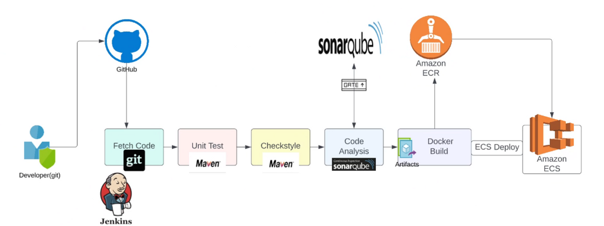
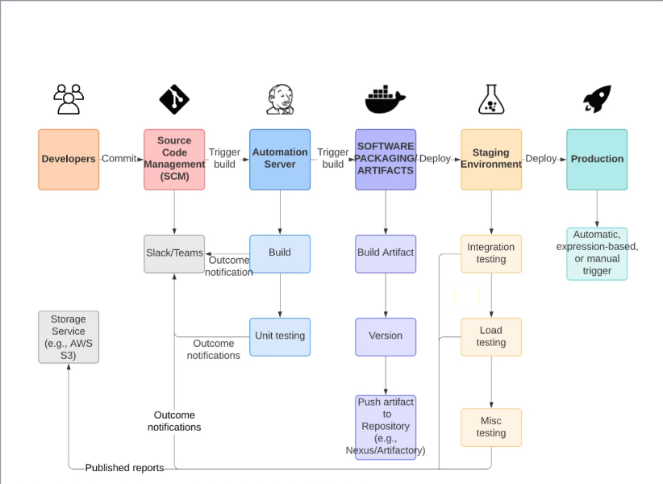

# Continuous Delivery of Java Web Application

## Scenario
- Agile SDLC.
- Developers make regular code changes.
- These commits needs to be Build & Tested.
- Package/Software/Artifact Deployment on server.
- Software testing/integration testing after deployment.
- Test report gets Evaluated and approval for prod deploy issued.

## Problem
Issues with current situation
- In an agile SDLC, there will be frequent code changes.
- Manual code deployment is time consuming.
- Involves task assignment/ticketing/approvals.
- Dependency on Ops & Build & Release Team.
  
## Solution
- Build, Test, Deploy & Test for every commit.
- Automated process
- Notify for every build status.
- Fix code if bugs or error found instantly rather than waiting.

## Benefits
- CD Pipeline
  - Agile
  - Fault Isolation
  - Short MTTR
  - No human intervention

## Tools
- Jenkins
- Nexus Sonartype Repository
- Sonarqube
- Maven
- Git
- Slack
- Docker
- AWS ECR
- AWS ECS
- AWS CLI

## Architecture Flow

## Objective
- Goals
  - Fault Isolation
  - Short MTTR
  - Fast turn around on feature changes
  - Less disruptive

## Architecture of Continuous Delivery Pipeline

## Flow of execution
1. Update github webhook with new Jenkins IP
2. Copy Docker file from vprofile repo to our repo
3. Prepare two separate Jenkins file for staging & prod in Source Code 
4. AWS steps   
   a. IAM, ECR Repo setup
5. Jenkins steps  
   a. Install plugins  
         i. Amazon ECR  
         ii. Docker, Docker build & publish  
         iii. Pipeline: aws steps
6. Install docker engine & aws cli on jenkins
7. Write Jenkins file for build & publish image to ECR
8. ECS setup
   a. Cluster, Task definition, Service
9. Code for Deploy Docker image to ECS
10. Repeat the steps for prod ECS cluster
11. Promoting docker image for prod 